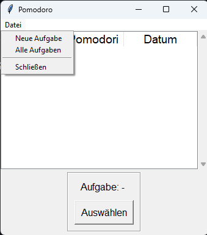
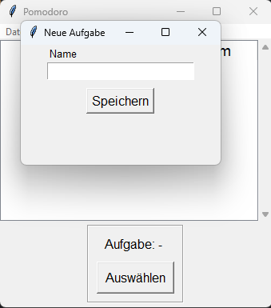
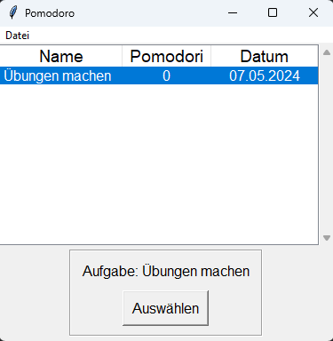
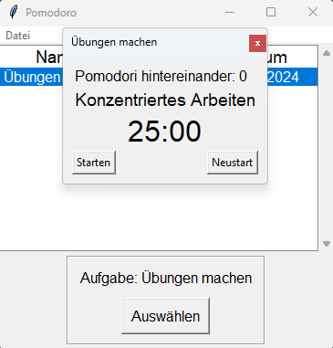
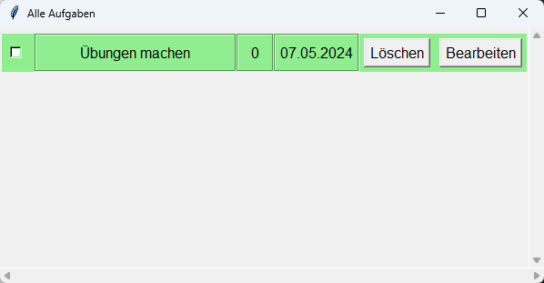
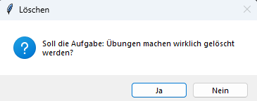

# Geburtstage Benachrichtigung

## Inhaltsverzeichnis
1. [Beschreibung](#beschreibung)
2. [Verwendung](#verwendung)
3. [Anleitung](#anleitung)
4. [Voraussetzung](#voraussetzung)
   - [pygame](#pygame)
5. [Autor](#autor)
6. [Lizenz](#lizenz)


## Beschreibung

Mit dieser Anwendung kann ein Timer erstellt und benutzt werden, der nach der Pomodoro-Technik
[(Wikipedia)](https://de.wikipedia.org/wiki/Pomodoro-Technik) funktioniert. Damit wird für 25 Minuten gearbeitet und
anschließend folgt eine Pause von 5 Minuten.

## Verwendung
Die main.py Datei ausführen und in der Menüleiste gibt es die Möglichkeit eine neue Aufgabe zu erstellen oder bereits
erstellte Aufgaben anzusehen. In dem Hauptfenster kann eine Aufgabe ausgewählt und im Anschluss gestartet werden. In
dem neuen Fenster kann der Timer gestartet, pausiert oder neu gestartet werden. Nach Ablauf der Zeit wird ein Ton
ausgegeben.

## Anleitung
Die main.py Datei ausführen und es erscheint ein Fenster. In der Menüleiste kann eine neue Aufgabe erstellt, alle 
Aufgaben angesehen oder das Programm geschlossen werden.



Nachdem das Feld für "Neue Aufgabe" ausgewählt wurde, erscheint ein neues Fenster, indem die neue Aufgabe benannt werden
soll und im Anschluss wird auf "Speichern" geklickt.



Im Hauptfenster ist die neue Aufgabe dann zu sehen. Wenn diese ausgewählt wurde, wird mit "Auswählen" bestätigt und es
wird ein neues Fenster angezeigt.




Der Timer kann nun gestartet, pausiert oder neu gestartet werden.

Im Hauptfenster, in der Menüleiste, können alle Aufgaben überblickt, bearbeitet oder gelöscht werden. Wenn eine Aufgabe
als abgeschlossen gilt, dann muss vor dem Namen ein Haken im Kästchen gesetzt werden. Die Aufgabe, die als erledigt gilt,
wird im Hauptfenster nicht mehr angezeigt. Falls eine Aufgabe gelöscht werden muss, muss dieses dann bestätigt werden.




## Voraussetzung
- pygame
### pygame
Die pygame Bibliothek wird für das Ausführen von Sounds genutzt.

In die Kommandozeile folgenden Befehl eingeben:
````shell
pip install pygame
````
Die Ausgabe sollte folgende sein (Stand 07.04.2024):
````shell
Collecting pygame
  Using cached pygame-2.5.2-cp312-cp312-win_amd64.whl.metadata (13 kB)
Using cached pygame-2.5.2-cp312-cp312-win_amd64.whl (10.8 MB)
Installing collected packages: pygame
Successfully installed pygame-2.5.2
````


## Autor
[](https://github.com/PixelPilot24)

## Lizenz
[MIT](https://choosealicense.com/licenses/mit/)